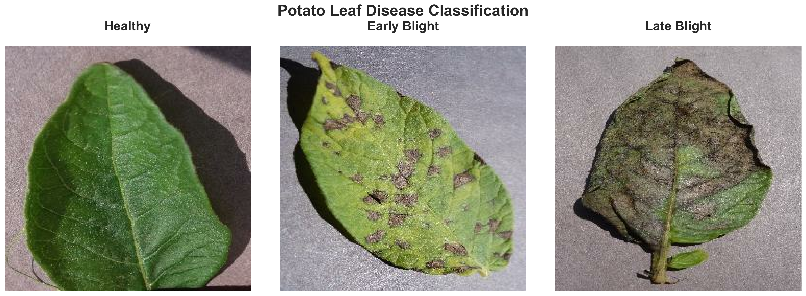

# Potato disease detection using deep learning

### Motivation

Most of my work involves tabular ML models and text classification using LLMs via API services like AWS Bedrock. In this project I wantto to expand my toolkit by exploring image classification, particularly understanding how convolutional neural networks work, as well as pooling layers and augmentation techniques to get practical experience with TensorFlow and Keras.

I chose the potato disease detection problem as a practical starting point. If successful, I plan to apply transfer learning to tomato disease classification to help identify issues early in my own backyard garden.

Again we will be following an ML development cycle from problem framing through to deployment, working with a multi-class image classification problem that has real agricultural applications.

## Dataset Classes

This project classifies potato leaf images into three categories:



### Disease Types

| Class | Pathogen | Symptoms |
|-------|----------|----------|
| **Healthy** | None | Green, vibrant leaves with no visible disease |
| **Early Blight** | *Alternaria solani* | Brown spots with concentric rings (target pattern) |
| **Late Blight** | *Phytophthora infestans* | Water-soaked lesions, potential white mold on leaf undersides |

## Dataset Overview

- **Total Images**: ~2,112
- **Training Set**: 1,728 images (80%)
- **Validation Set**: 384 images (20%)
- **Image Size**: 256×256 pixels
- **Classes**: 3 (Healthy, Early Blight, Late Blight)
- **Batch Size**: 32
- **Random Seed**: 78 (for reproducibility)

## Project Structure
```
Fun-fire-blight-detection/
├── 00_data/              # Dataset storage (not in version control)
│   ├── raw/              # Original images organized by class
│   └── processed/        # Preprocessed data
├── 01_notebooks/         # Jupyter notebooks for exploration
│   └── 01_data_loading.ipynb
├── 02_outputs/           # Model outputs and predictions
│   ├── models/           # Trained model checkpoints
│   └── predictions/      # Prediction results
├── docs/                 # Documentation and images
│   └── images/           # Visual assets for README
├── src/                  # Source code (Python package)
│   ├── data/             # Data processing modules
│   ├── models/           # Model architectures
│   └── utils/            # Helper functions
├── scripts/              # Executable training/inference scripts
├── requirements.txt      # Python dependencies
└── README.md            # This file
```


## License

MIT License - see [LICENSE](LICENSE) file for details

## Author

**Adama Abanteriba**
- GitHub: [@Thrawn6595](https://github.com/Thrawn6595)
- Project: [Fun-fire-blight-detection](https://github.com/Thrawn6595/Fun-fire-blight-detection)

## Acknowledgments

- Dataset: PlantVillage Dataset
- Inspired by agricultural AI applications for disease detection

---
